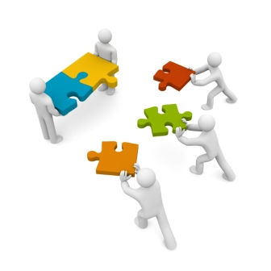
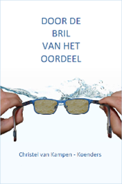

# Gevoel in balans

Wanneer we *in* balans zijn *voelen* we dat. Wanneer we niet in balans zijn *voelen* we dat ook. Probeer eens een handstand te doen of over een dunne balk te lopen en je voelt direct of je de juiste balans hebt.

Ons gevoel is dé informatiebron die ons vertelt of er een goede balans is in de dingen die we doen. Ons gevoel vertelt ook hoe het met ons is, hoe we onze relaties ervaren, of we energiek zijn of stress ervaren. Ons gevoel geeft ons richting wanneer we keuzes maken.

Emotioneel welbevinden de balans is tussen positieve en negatieve gevoelens.
Voel je je in balans dan voel je bijvoorbeeld ontspanning, rustige ademhaling, behagelijke warmte, energie.
Voel je je uit balans dan voel je bijvoorbeeld opgetrokken schouders, een aangespannen buik, klamme handen, hart in de keel, korte ademhaling, onrust.

Kortom balans of niet, we *voelen* het.

# Trauma en Herstel

Trauma is het gevolg van schokkende, ingrijpende gebeurtenissen die diepe sporen hebben achtergelaten en een schaduw werpen over het leven. Machteloosheid, pijn, onveiligheid, (doods)angst, woede, ontworteling, verscheurdheid, paniek, schuldgevoel, schaamte, walging, afschuw, nachtmerries, flashbacks, piekeren, slecht slapen, veranderde eetlust, prikkelbaarheid, concentratieproblemen, een gevoel van ‘er niet bij zijn’.

Hoe heb je gereageerd in die situatie? Heb je gevochten, ben je gevlucht of kon je niets meer, was je bevroren? Welke reactie er ook was, het was een reactie die voortkwam uit je instinct. Iedereen reageert instinctief in een situatie die onveilig en ingrijpend is. En dat kan ook in elke situatie anders zijn. Deze instinctieve reactie overkomt ons, net zoals de onveilige, ingrijpende situatie ons overkomt. Het gevoel dat we alle controle / grip kwijt zijn, het gevoel dat we niet hebben gereageerd zoals we dat hadden gewild. Een mogelijke verandering van ons zelfbeeld met boosheid, schaamte- en schuld gevoelens tot gevolg.

Veiligheid en controle herwinnen is de eerste stap op weg naar herstel. Herstel is essentieel om emotioneel tot rust te komen. Herstel is ook essentieel om ruimte te kunnen maken voor eigen wensen en behoeftes in het leven die vreugde brengen. Herstel betekent ruimte maken om betekenis te kunnen geven aan ervaringen en ook ruimte maken voor ontspannende activiteiten en ruimte maken om vorm te geven aan datgene wat als waardevol wordt gezien en ervaren.  

# Supervisie

Supervisie is voor professionals met een mensgericht beroep die werkzaam zijn in het werkveld en / of in opleiding zijn. Denk aan maatschappelijk werkers, groepswerkers, psychologen, therapeuten, docenten, fysiotherapeuten, predikanten, geestelijk verzorgers, verpleegkundigen, artsen, managers, coaches.

Supervisie volg je wanneer je je professionaliteit (verder) wilt ontwikkelen. En wanneer je zicht wilt krijgen op patronen die belemmerend werken en op patronen die je helpen om succesvol te zijn.

Zelfreflectie is de sleutel van supervisie, want we leren niet van ervaringen maar we leren van de reflectie op onze ervaringen.

Met behulp van zelfreflectie leer je jezelf beter kennen. Hoe we zijn opgegroeid, welke normen en waarden we hebben meegekregen, onze cultuur, eventuele religie, welke ervaringen we hebben opgedaan in het leven, wie ons steunde, enz. het heeft ons gemaakt wie we nu zijn. Het heeft ons een kader gegeven waaruit we denken, voelen, dingen willen en handelen. Door ons bewust te worden van onderliggende beweegredenen, waarden, behoeftes en emoties, worden we meer bewust van wie we zijn. Dat is een basis om vervolgens te onderzoeken wie we willen zijn of al zijn als professional. Een timmerman heeft een hamer en spijkers als gereedschap. Een professional met een mensgericht beroep is zelf het gereedschap. Daarom vraagt dat om zelfreflectie en zelfkennis.

Daarbij leer je in supervisie niet alleen wie je bent als mens en als professional maar ook hoe je leert.  En iedereen leert op zijn eigen unieke wijze. In supervisie krijg je ook hier meer zicht op. En dat is belangrijk zodat je zelf in staat bent om je eigen leerroute te bewandelen op een manier die past bij wat voor jou helpt, wat je uitdaagt en wat vertrouwt voelt.

In supervisie komen de zojuist genoemde drie dimensies van wie je bent als mens, als professional en hoe je leert samen. Supervisie helpt deze drie dimensies te integreren. Waardoor je een Bewust bekwaam professional wordt.

## Hoe werkt supervisie nu in de praktijk

In je werk of stage kom je allerlei dingen tegen die leuk zijn, moeilijk zijn, spanning oproepen, onbegrijpelijke situaties, situaties waar je je vinger niet op kan leggen, situaties waarbij het zweet je uitbreekt of die woede oproepen en ook successen, ontspannen gesprekken, plezier, en uitdagingen.

In supervisie neem je een concreet voorbeeld mee uit je werk of stage die jij graag wilt onderzoeken. Deze situatie ga je onder de loep leggen door de situatie zo duidelijk mogelijk te beschrijven. Vaak heb je een leervraag a.d.h.v. die situatie of ontstaat de leervraag nadat je de situatie hebt onderzocht.

Het onderzoek vindt plaats a.d.h.v. wat er gebeurde in de door jou ingebrachte situatie, wat je wilde, hoe je hebt gehandeld, welke gedachten er door je heen gingen en wat je voelde. Dit onderzoekende geeft vaak veel helderheid. Je ontdekt waar je kracht ligt of welke waarden een rol hadden, je ontdekt patronen, je krijgt inzicht. Je geeft betekenis aan de situatie en vervolgens neem je mee wat je wilt leren.

Daarna maak je een plan, je kiest wat je wilt leren en hoe je dat wilt gaan aanpakken. Dan is het fijn dat je jouw manier van leren kent en deze kan inzetten om in de praktijk te gaan oefenen. Nadat je in de praktijk hebt uitgevoerd wat je van plan was, ga je opnieuw reflecteren. Hoe heb ik het gedaan wat ik heb geleerd.

Supervisie is een cyclische leerweg waarin opnieuw zelfreflectie inzicht zal geven en je opnieuw zal helpen om volgende stappen te kiezen en uit te voeren.

 Geregistreerd supervisor sinds 2008 S12458H

# Intervisie

Intervisie is voor professionele teams met een mensgericht beroep. Denk aan maatschappelijk werkers, groepswerkers, psychologen, therapeuten, docenten, fysiotherapeuten, predikanten, geestelijk verzorgers, verpleegkundigen, artsen, managers, coaches.

Intervisie zorgt voor een professionele uitwisseling tussen medewerkers die werkzaam zijn in hetzelfde vakgebied. Het doel is de deskundigheid van de betrokkenen te bevorderen en de kwaliteit van het werk te verbeteren.  

Mogelijke doelen:

-	Verbetering van de werkprestaties
-	Meer efficiëntie bij het uitvoeren van taken
-	Beter omgaan met problematische situaties
-	Verbetering van de onderlinge samenwerking
-	Verkrijgen van een gedeeld begrip binnen het team

 Geregistreerd supervisor sinds 2008 S12458H

# Door de bril van het oordeel

Dit boek is in 2016 uitgebracht en gaat over het effect van waardeoordelen op onze psychische gesteldheid en op onze relaties. Ook de invloed op ons gedrag en ons gevoel wordt beschreven. Het boek geeft inzicht over het waarom van waardeoordelen en helpt ontdekken wie je bent en waar je werkelijk naar verlangt.

Er worden oefeningen en aanwijzingen in beschreven die de verbondenheid met onszelf en anderen bevorderen.

# Contact

Christel van Kampen

0640006366

christel@gevoelinbalans.nl
